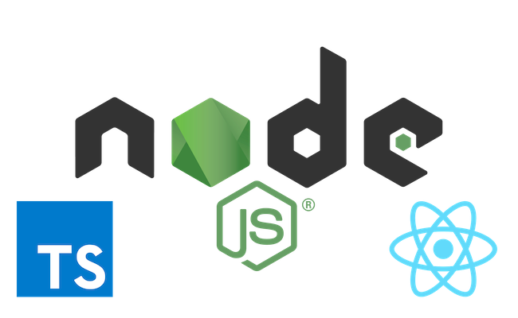

# webpack-ssr-react-ts-react-router

Webpack 4 simple boilerplate for Server Side Rendering with Node, React 16, React Router 4 with Typescript 3 & SASS

# Includes
- Node v11
- Express v4
- React v16
- React Router 4
- Typescript v3
- Sass loader (for client config)

# Instructions

- Clone this repo
- `npm install`
- `npm run build`
- `npm start`
